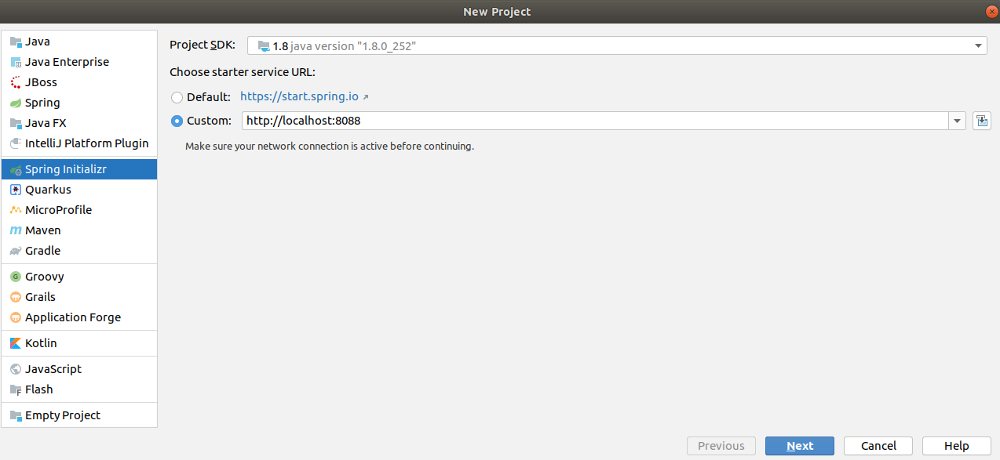
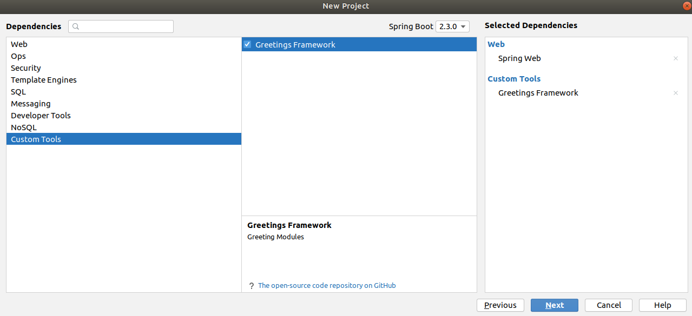

# SpringQuickInitializr
Spring Quick Initializr
Every good Spring Boot project usually starts at https://start.spring.io/. While this probably holds true for thousands of software projects every year, the app behind the scenes, the so-called Spring Initialzr, is Open Source as well and can even be customized to your own needs.
This repository configures a Spring Initializr instance with a custom UI running at https://start.spring.io.

##### Building from Source
You need Java 1.8 and a bash-like shell.

- Step 1: We need to create Spring boot Application including "initializr-web", "initializr-generator-spring" as a dependency.
- Step 2: open the project with an editor & Add Dependency management in pom.xml:
```
<dependencyManagement>
        <dependencies>
            <dependency>
                <groupId>io.spring.initializr</groupId>
                <artifactId>initializr-bom</artifactId>
                <version>0.8.0.RELEASE</version>
                <type>pom</type>
                <scope>import</scope>
            </dependency>
        </dependencies>
    </dependencyManagement>
```

- Step 3: rename the "application.properties" to "application.yaml" And add the initializr configuration.


##### Custom Dependency
```
..................................
- name: Custom Tools
      content:
        - name: Greetings Framework
          id: custom-module
          groupId: com.extremecoder
          artifactId: custom-modules
          version: 1.0-SNAPSHOT
          description: Greeting Modules
          repository: custom-module-repo
          links:
            - rel: source
              href: https://github.com/rakib09/custom-module
              description: The open-source code repository on GitHub
  env:
    repositories:
      custom-module-repo:
        name: custom-module
        url: https://github.com/rakib09/custom-module
```

##### Building
Invoke the build at the root of the project


```
$ ./mvnw clean install 
```

After running application we can create a project using intelijj.


Dependency selection


##### Created sample project
https://github.com/rakib09/spring-boot-app

Your Application is ready.


##### Reference: 
[spring.io](https://docs.spring.io/initializr/docs/current/reference/html/)

##### Encouraged By
[Netflix Spring Initializr](https://spring.io/blog/2020/02/24/netflix-built-a-spring-application-generator-to-boost-dev-productivity-here-s-how-you-can-too) 
